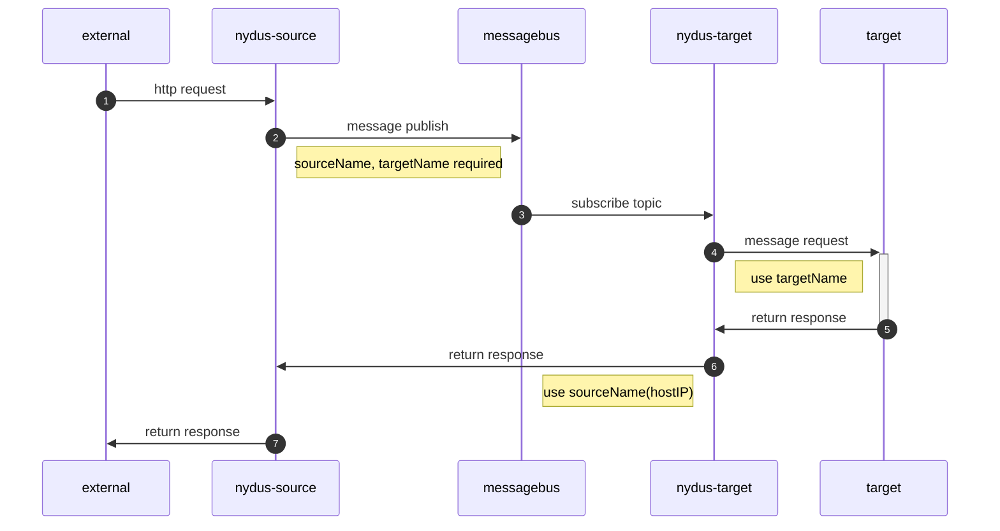

# nydus

Nydus is an addon that helps change the microservice architecture based on sync requests to message-based design by changing the request address.

The monolithic msa conversion journey is difficult. In particular, the final step to moving to a message-based request handling design, rather than end with chopping the service, requires a lot to be fixed.

Nydus does not change the structure of direct http requests, but instead executes pubsub so you can use message queues. The advantage of using a message queue is that it can scale based on the length of the message without losing requests.

At this time, nydus publishes http requests, subscribes to external requests or as a sidecar of the service to which it belongs, and delivers http responses.

Nydus is helped by a giant named dapr.

## Initial step

### install dapr

#### kubernetes

```sh
kubectl config use-context docker-desktop
dapr init -k --runtime-version 1.0.0-rc.4
```

check work done
```sh
dapr status -k
```

redis is for state store and pubsub. 
```sh
helm repo add bitnami https://charts.bitnami.com/bitnami
helm install redis bitnami/redis
k apply -f componants/stateStore.yaml
k apply -f componants/pubsub.yaml
```

#### stand-alone

```sh
dapr init --runtime-version 1.0.0
```

# Component Overview

https://docs.google.com/presentation/d/1Zt2BdLL2wtcwq4M5H687UNUdntpjWGClBe6g8NaCid4/edit#slide=id.p



## sidecar

for service in kubernetes.

## stand-alone

for external service out of kubernetes.

### run command

```
dapr run \
		--app-id nydus \
    --app-port 5000 \
		--app-protocol http \
		--dapr-http-port 3500 \
        go run main.go
```


## TODO

[] build injector
[] create CRD