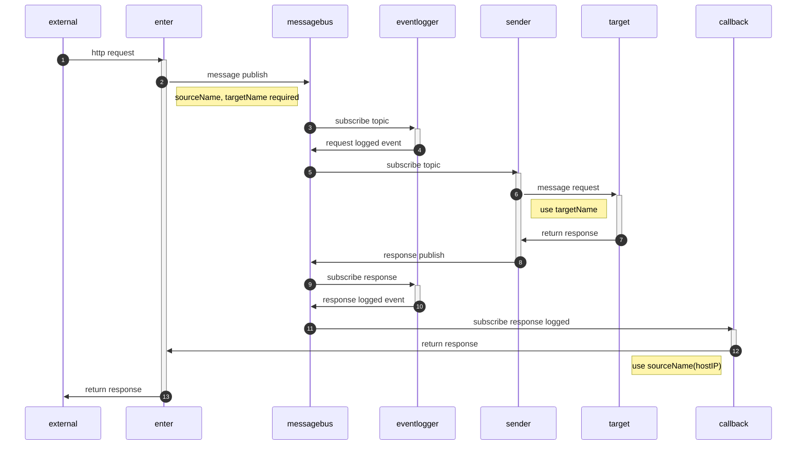

# nydus

## Initial step

### install dapr

```sh
kubectl config use-context docker-desktop
dapr init -k --runtime-version 1.0.0-rc.3
```

### check work done

```sh
dapr status -k
```

### set redis

redis is for state store and pubsub. 

```sh
helm repo add bitnami https://charts.bitnami.com/bitnami
helm install redis bitnami/redis
k apply -f componants/stateStore.yaml
k apply -f componants/pubsub.yaml
```

# Component Overview

* external: request system
* enter: nydus-enter is http asyncer.
* messagebus: message queue in nydus system.
* callback: return to response to enter when scale out.
* sender: convert from pubsub to request end return to pubsub.
* eventlogger: recode request and response.
* target: target system




# nydus-enter

https://jacking75.github.io/go_channel_howto/

sync로 요청하는 http 연결을 뒤에 pubsub에 보내고 응답을 받을 때 까지 유지하는 역할.
request와 callback 2개의 엔드포인트가 필요함.
request-id 이름으로 callback 엔드포인트에 체널을 보내두고 id=request-id 인 것이 있을 때 해당 체널로 body를 전달하여 result를 응답함.

## endpoint
### /invoke/:target

외부에서 target 으로 http 요청을 하는 것을 모사함.
요청을 받으면 targetName과 자신의 hostIP를 추가하여 pub을 진행.

### /callback/:id

응답 바디를 받아서 invoke를 수행하고 기다리고 있는 프로세스에 전달

#### caster 패키지

프로세스간 통신 방법을 제공.

https://github.com/guiguan/caster#broadcast-a-go-channel


# nydus-subquest

subquest subscribe dapr pubsub topic and request legacy system and publish result topic.

## env

source-topic(required): 
result-topic(required): 
target-root(required):


## data format

1개로 다 합치기로

그래서 확인 해야 하는 기능
topic sub을 다이나믹으로 할 수 있는지


```
dapr run \
		--app-id add-on \
    --app-port 8080 \
		--app-protocol http \
		--dapr-http-port 3500 \
        go run main.go
```