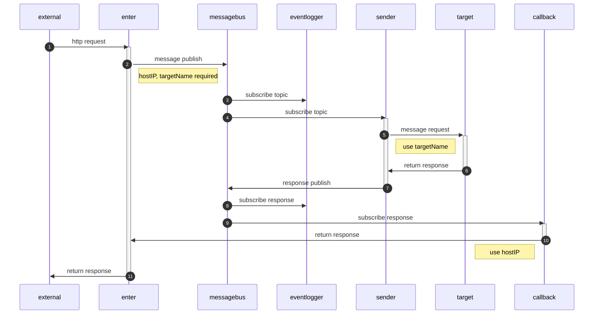

# nydus

## Initial step

### install dapr

```sh
kubectl config use-context docker-desktop
dapr init -k --runtime-version 1.0.0-rc.3
```

### check work done

```sh
dapr status -k
```

### set redis

redis is for state store and pubsub. 

```sh
helm repo add bitnami https://charts.bitnami.com/bitnami
helm install redis bitnami/redis
k apply -f componants/stateStore.yaml
k apply -f componants/pubsub.yaml
```

# Component Overview

* external: request system
* enter: nydus-enter is http asyncer.
* messagebus: message queue in nydus system.
* callback: return to response to enter when scale out.
* sender: convert from pubsub to request end return to pubsub.
* eventlogger: recode request and response.
* target: target system



